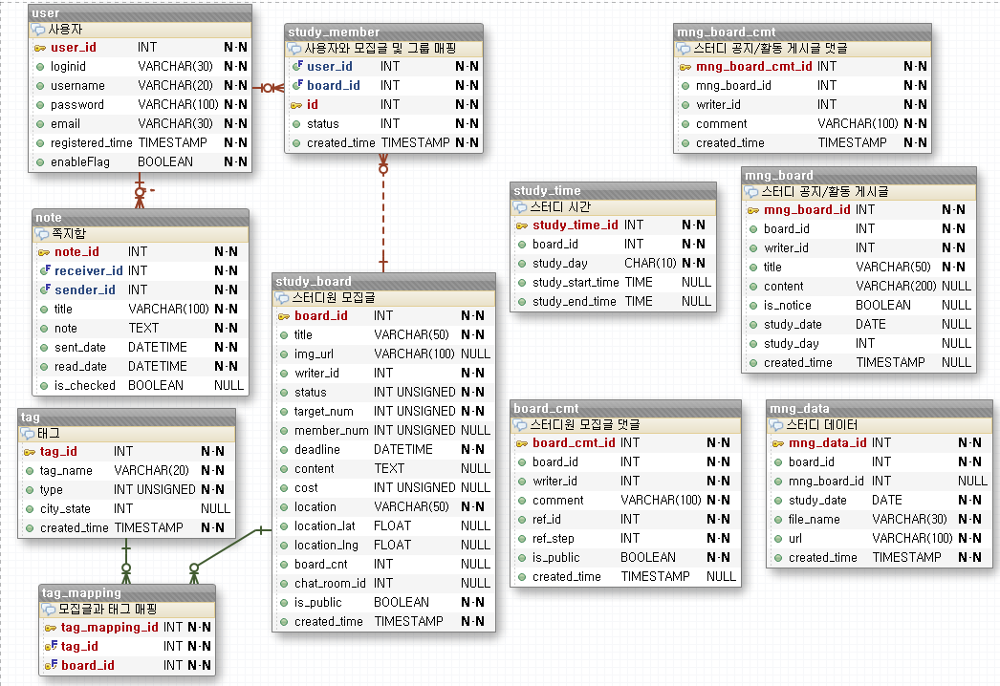
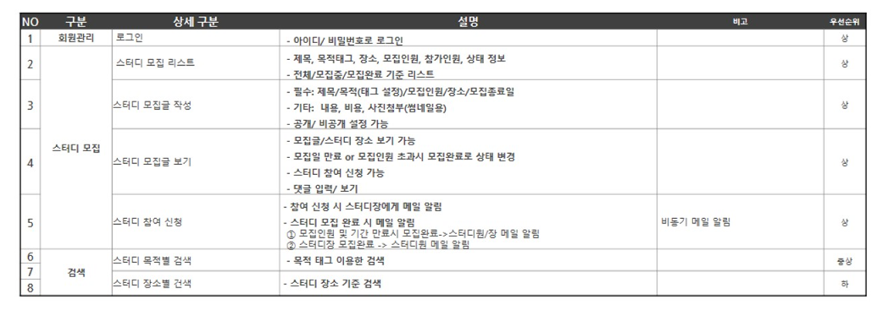

# 스터디 모집 사이트

## ⭐️Intro

> spring boot 기반으로 개발된 '스터디 모집 사이트' back-end에 대한 문서

## Getting Started

### Prerequisites

- java 1.8
- mariaDB 10.4.6

### Run in development

```powershell
# 스터디 모집 사이트 레포 클론
> git clone http://rnd2.iljincns.co.kr:8888/390815/get-together-back.git

# 메이븐 설치
> mvn install

# spring boot실행
> mvn spring-boot:run
```

### Project folder structure

* core패키지: 공통기능(security, file,config등)
  * config: 설정 패키지
  * scheduled: 스케쥴 서비스 패키지
  * security: 회원관리 패키지(spring security사용)
  * file: 파일 관련 패키지
* api패키지
  * recurit: 스터디 모집 패키지
  * note: 쪽지(note) 패키지
  * tag: 태그 패키지
  * search:검색 패키지
  * management:스터디 관리 패키지

~~~
```
src/main
├── resources
│		├── mapper
│			├── accounts.xml //user관련
│			├── note.xml // 쪽지(note) 관련
│			├── recruit.xml //스터디 모집 관련
│			├── recruitCmt.xml // 댓글(board_cmt) 관련
│			├── search.xml // 검색 관련 쿼리
│			├── tag.xml //tag관련
│		├── application.properties //설정
├── java
│   ├── com.mini.studyservice
│   	├── core 
│   		├── config //설정
│   			├── AsyncConfig // 비동기 설정
│   			├── CorsConfig // CORS 설정
│   			├── DefaultConfig //전역 변수
│   			├── MybatisConfig //myBatis관련 설정
│   			├── SecurityConfig //spring security 설정
│   			├── fileStorageConfig //파일 설정
│   		├── file
│   			├── CustomFileNotException
│   			├── FileController
│   			├── FileService
│   			├── FileStorageException
│   			├── UploadFileResponse
│   		├── scheduled //스케줄링 패키지
│   			├── Schedule // 스케쥴링 하는 위치
│   			├── ScheduleService
│   		├── security
│   			├── account //user 관련 패키지
│   				├── controller
│   					├── UserController
│   				├── dao
│   					├── UserDao
│   			 	├── dto
│   					├── User
│   					├── UserDto
│   				├── service
│   					├── UserService
│   			├── AuthToken // token dto
│   			├── LoginController
│   			├── SimpleCorsFilter
│   		├── util
│   			├── error //에러
│   			├── message // 쪽지 및 메세지 관련 util
│   	├── api
│   		├── note //쪽지 api
│   			├── controller
│   				├── NoteController
│   			├── dao
│   				├── NoteDao
│   			├── dto
│   				├── Note
│   				├── NoteDto
│   		├── recruit //스터디 모집 api
│   			├── controller
│   				├── CommentController //스터디 모집 댓글 controller
│   				├── RecruitController //스터디 모집 controller
│   			├── dao
│   				├── CommentDao
│   				├── RecruitDao
│   			├── dto
│   				├── BoardCmt // study_board의 댓글
│   				├── BoardCmtDto
│   				├── StudyBoard
│   				├── StudyBoardDto
│   				├── StudyMember
│   				├── StudyMemberDto
│   				├── StudyMemberUser //study_member와 user정보
│   				├── StudyTime
│   				├── StudyTimeDto
│   			├── service
│   				├── CommentService
│   				├── RecruiteService
│   		├── tag //태그 api
│   			├── controller
│   			├── dao
│   				├── TagDao
│   			├── dto
│   				├── Tag
│   				├── TagDto
│   				├── TagMapping
│   			├── service
│   		├── management //스터디 관리 api
│   			├── controller
│   			├── dao
│   			├── dto
│   			├── service
│   		├── search //검색 api
│   			├── controller
│   				├── StudyBoardSearchController
│   			├── dao
│   				├── StudyBoardSearchDao
│   			├── dto
│   			├── service
│   				├── StudyBoardService

```
~~~

### ERD



## DB

>  mariaDB 사용

### 셋팅

```mariadb
//db생성
create database study_db default character set utf8;
//user 계정 생성
create user studyuser identified by '1234';
//user 권한 주기
grant all privileges on study_db.* to studyuser;
//권한 확인
show grants for studyuser
//기본으로 생성되어 있는 mysql데이터베이스에서 user테이블에서 이미 생성된 계정 확인
select host, user from user;
```

### DDL실행

```mysql
source <파일명>;
source d:/get-together-back/study.sql
```

## 주요 설정

1. application.properties파일 참조

## 요구사항

> 유사 사이트(밋업, 커넥츠) 등을 참고하여 스터디 모집 사이트에 필요한 요구사항 정리



## 셋팅방법

### Spring boot

> https://start.spring.io/

* https://start.spring.io/에서 spring project생성
  * starter에 추가한 것
    * mybatis framework
    * spring web
    * jdbc api
    * spring session
    * spring security
    * websocket
    * 기타
      * spring boot devtools
      * lombok

* restful service
* security

### mariaDB

* `pom.xml`에 dependency 추가

  ```xml
  <dependency>
      <groupId>org.springframework.boot</groupId>
      <artifactId>spring-boot-starter-jdbc</artifactId>
  </dependency>
  <dependency>
      <groupId>org.mariadb.jdbc</groupId>
      <artifactId>mariadb-java-client</artifactId>
  </dependency>
  ```

* `application.properties`

  ```properties
  # mariaDB
  spring.datasorce.driverClassName=org.mariadb.jdbc.Driver
  spring.datasource.url=jdbc:mariadb://localhost:3306/study_db
  spring.datasource.username=studyuser
  spring.datasource.password=1234
  ```


## 기타

### 로그인 인증이 필요한 경우

* headers

  * key: x-auth-token
  * value: token값(로그인시 생성된 토큰 값)

  

